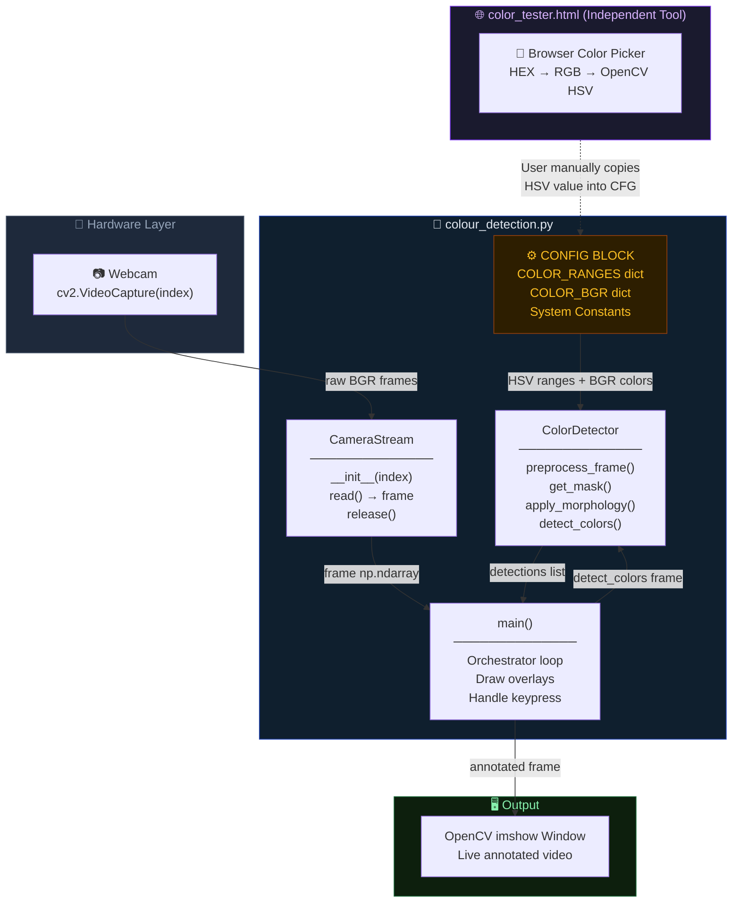
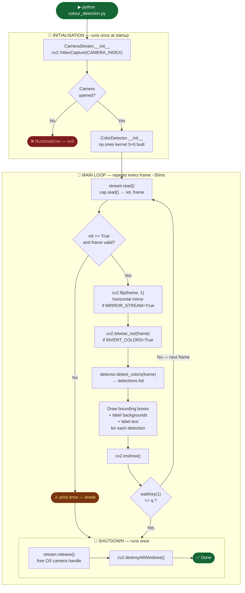
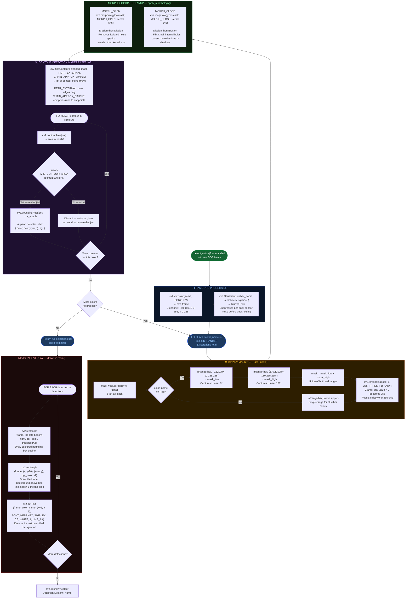
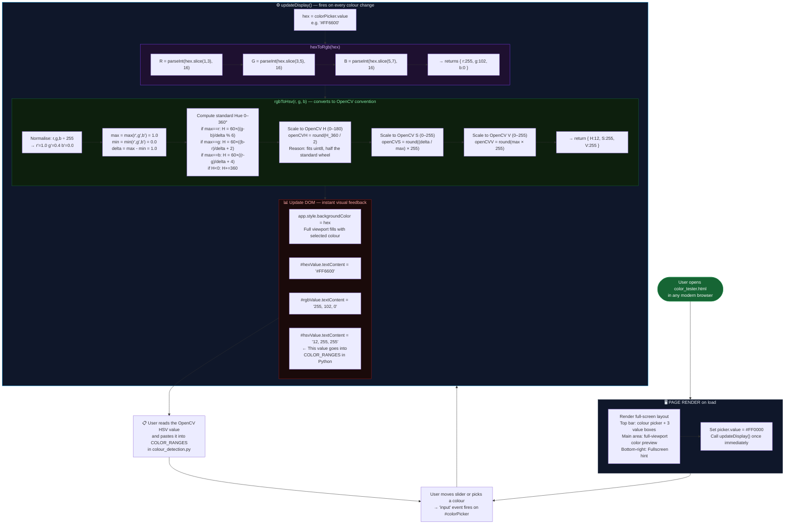
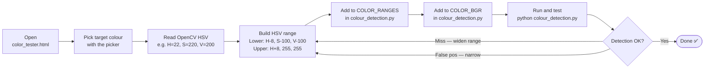

# 🎨 Real-Time Colour Detection System

> A production-grade, webcam-based colour detection engine built with **Python + OpenCV + NumPy**,  
> paired with a zero-dependency **browser calibration tool** — no extra installs required.

[](https://www.python.org/)
[](https://opencv.org/)
[](https://numpy.org/)
[](LICENSE)
[]()

---

## 📑 Table of Contents

1. [What This Project Does](#1-what-this-project-does)
2. [Repository Structure](#2-repository-structure)
3. [High-Level System Architecture](#3-high-level-system-architecture)
4. [Complete Processing Pipeline — Flowchart](#4-complete-processing-pipeline--flowchart)
5. [Per-Frame Detection Loop — Detailed Flowchart](#5-per-frame-detection-loop--detailed-flowchart)
6. [Color Tester Tool — Logic Flowchart](#6-color-tester-tool--logic-flowchart)
7. [Core Theory & Computer Vision Concepts](#7-core-theory--computer-vision-concepts)
   - [7.1 Colour Spaces: BGR vs HSV](#71-colour-spaces-bgr-vs-hsv)
   - [7.2 The Hue Wheel & Red's Dual-Range Problem](#72-the-hue-wheel--reds-dual-range-problem)
   - [7.3 Gaussian Blur](#73-gaussian-blur)
   - [7.4 Binary Masking with cv2.inRange](#74-binary-masking-with-cv2inrange)
   - [7.5 Morphological Operations](#75-morphological-operations)
   - [7.6 Contour Detection & Bounding Rectangles](#76-contour-detection--bounding-rectangles)
   - [7.7 Area Filtering](#77-area-filtering)
8. [File Deep Dive: colour\_detection.py](#8-file-deep-dive-colour_detectionpy)
   - [8.1 Configuration Block](#81-configuration-block)
   - [8.2 Class: ColorDetector](#82-class-colordetector)
   - [8.3 Class: CameraStream](#83-class-camerastream)
   - [8.4 main() Function](#84-main-function)
9. [File Deep Dive: color\_tester.html](#9-file-deep-dive-color_testerhtml)
10. [Full Colour Reference Table](#10-full-colour-reference-table)
11. [Configuration Parameters Reference](#11-configuration-parameters-reference)
12. [Setup & Installation](#12-setup--installation)
13. [Running the System](#13-running-the-system)
14. [Using the HSV Calibration Tool](#14-using-the-hsv-calibration-tool)
15. [Customization Guide](#15-customization-guide)
16. [Troubleshooting Guide](#16-troubleshooting-guide)
17. [Performance Notes](#17-performance-notes)
18. [Future Roadmap](#18-future-roadmap)
19. [License](#19-license)

---

## 1. What This Project Does

The **Real-Time Colour Detection System** turns any webcam into a live colour-sensing instrument. Every video frame is run through a carefully ordered image-processing pipeline:

1. Raw BGR camera frames are captured continuously.
2. Each frame is converted to **HSV colour space** — separating "what colour" from "how bright" — making detection robust to lighting changes.
3. **Binary masks** are generated for each of 13 pre-configured colours by testing whether each pixel's HSV values fall inside a known range.
4. **Morphological operations** clean each mask — erasing speckle noise and filling internal holes.
5. **Contours** (connected blobs of white pixels) are found and filtered by minimum area.
6. Surviving detections receive **bounding boxes and colour-name labels** drawn directly on the live frame.

A separate browser-based tool (`color_tester.html`) converts any picked colour to its exact **OpenCV HSV triplet**, enabling anyone to calibrate and add new colours without writing code.

**Practical use cases:**
- Robotics: colour-guided object picking or line following
- Quality control: detecting off-colour items on a conveyor
- Educational demos for computer vision courses
- Accessibility tools for colour-blind users
- Prototyping for any vision-guided automation

---

## 2. Repository Structure

```
Real-Time-Colour-Detection-System/
│
├── colour_detection.py   ← Core Python engine (228 lines, 6.7 KB)
│                             CameraStream class
│                             ColorDetector class
│                             main() orchestrator
│
├── color_tester.html     ← Browser calibration tool (196 lines, 5.7 KB)
│                             HEX → RGB → OpenCV HSV converter
│                             Full-screen colour preview
│
├── .gitignore            ← Standard Python .gitignore
└── README.md             ← This file
```

| File | Language | Lines | Role |
|------|----------|-------|------|
| `colour_detection.py` | Python 3 | 228 | Main application — detection engine, camera, display |
| `color_tester.html` | HTML5 + Vanilla JS | 196 | Standalone calibration — no server, no Python needed |

---

## 3. High-Level System Architecture



> The HTML tool and the Python engine are **fully decoupled**. The browser tool does zero detection — it only helps you find the right HSV numbers to paste into `COLOR_RANGES`.

---

## 4. Complete Processing Pipeline — Flowchart

The full program lifetime: startup → frame loop → shutdown.



---

## 5. Per-Frame Detection Loop — Detailed Flowchart

Zoom into exactly what `detector.detect_colors(frame)` does — every operation, every decision, every iteration.



---

## 6. Color Tester Tool — Logic Flowchart

Complete internal logic of `color_tester.html` from page load to HSV output.



---

## 7. Core Theory & Computer Vision Concepts

### 7.1 Colour Spaces: BGR vs HSV

OpenCV loads every camera frame in **BGR** order. BGR is fine for *displaying* images but terrible for *detecting* a specific colour under varying lighting, because a brightness change alters all three channel values simultaneously.

**HSV (Hue-Saturation-Value)** decouples colour identity from brightness:

```
CHANNEL         RANGE (OpenCV)   MEANING
──────────────────────────────────────────────────────────
H  (Hue)        0 – 180          WHAT colour  ("the name")
S  (Saturation) 0 – 255          How pure/vivid (0=grey, 255=vivid)
V  (Value)      0 – 255          How bright    (0=black, 255=full)
──────────────────────────────────────────────────────────

Real example — same yellow object, three lighting levels:

  Condition         BGR                    HSV
  ──────────────    ───────────────────    ─────────────────────
  Bright sunlight   (20,  245, 250)        H=30, S=246, V=250
  Indoor lamp       (10,  118, 120)        H=30, S=244, V=120
  Dim room          ( 5,   58,  60)        H=30, S=240, V=60

  BGR shifts completely in all three channels.
  HSV Hue stays fixed at H=30 across all lighting.

  Conclusion: threshold on H (and S/V range) → robust detection.
```

> **OpenCV HSV note:** Hue is 0–180 (not 0–360) to fit in an unsigned 8-bit byte.  
> The `color_tester.html` tool handles this conversion automatically.

---

### 7.2 The Hue Wheel & Red's Dual-Range Problem

```
OpenCV Hue Wheel  (values 0 – 180)

                  0 / 180
              ┌──── RED ────┐       ← wraps at both ends!
           170│             │10
         Magenta          Orange
        160│                 │20
       Pink                 Brown
      150│                    │25
    Purple                  Yellow
    140│                       │30
   Purple                    Yellow
   130│                         │35
  Blue-Violet               Yellow-Green
  120│                             │50
   Blue                          Green
   110│                           │70
    Blue                        Lime
     100│                       │80
       Cyan-Blue           Cyan-Green
          90 ─────── CYAN ─────── 90

Red occupies BOTH ends of the wheel: H=0–10 AND H=170–180.
Every other colour is a contiguous single arc.
```

This is why `COLOR_RANGES["Red"]` requires **two range tuples**:

```python
"Red": [
    ((0,   120, 70), (10,  255, 255)),   # Hue: 0  – 10  (low-end red)
    ((170, 120, 70), (180, 255, 255))    # Hue: 170– 180 (high-end red)
]
```

In `get_mask()`, both produce separate binary masks that are **added** (`mask += inRange(...)`) then thresholded — creating a union that catches all red hues in a single clean mask.

---

### 7.3 Gaussian Blur

The HSV frame is blurred before masking to smooth per-pixel sensor noise — single "hot" pixels with wildly wrong colour values that would otherwise cause false positives.

```
5×5 Gaussian Kernel (conceptual, normalised by ÷273):

   1   4   7   4   1
   4  16  26  16   4
   7  26  41  26   7
   4  16  26  16   4
   1   4   7   4   1

Centre pixel weight  ≈ 15%  of output value
Immediate neighbours ≈  9.5% each
Corner pixels        ≈  0.4% each

Effect on a noise pixel in a red region:
  Before blur:  pixel H = 45  (false green spike from sensor noise)
  After blur:   pixel H = (45×0.15 + 8×nearby_red_H×0.095...) ≈ H=9  (red)
                The noise is absorbed into surrounding true values.
```

Code: `cv2.GaussianBlur(hsv_frame, (5, 5), 0)`

`sigma=0` lets OpenCV auto-compute σ from the kernel size: `σ = 0.3×((5−1)×0.5 − 1) + 0.8 = 1.1`

---

### 7.4 Binary Masking with cv2.inRange

`cv2.inRange(src, lower, upper)` tests every pixel independently:

```
For each pixel at (row, col):
  [ H, S, V ] = hsv_frame[row, col]

  if lower[0] ≤ H ≤ upper[0]
  AND lower[1] ≤ S ≤ upper[1]
  AND lower[2] ≤ V ≤ upper[2]:
      mask[row, col] = 255   ← "yes, this is the target colour"
  else:
      mask[row, col] = 0     ← "no"

Visual:
  Camera frame (H×W×3 HSV)         Mask for "Blue" (H×W uint8)
  ┌─────────────────────────┐       ┌─────────────────────────┐
  │ red  orange  blue  blue  │       │  0    0    255  255     │
  │ green green  blue  grey  │  ──▶  │  0    0    255   0      │
  │ red  yellow  grey  grey  │       │  0    0     0    0      │
  └─────────────────────────┘       └─────────────────────────┘
                                      255 = target colour present
                                        0 = not target colour
```

---

### 7.5 Morphological Operations

Raw binary masks contain artefacts — noise specks and holes. Two operations fix both:

```
KERNEL: np.ones((5,5), np.uint8)  — flat 5×5 square structuring element

━━━━━━━━━━━━━━━━━━━━━━━━━━━━━━━━━━━━━━━━━━━━━━━━━━━━━━━━
OPERATION 1 — MORPHOLOGICAL OPENING  (Erosion → Dilation)
━━━━━━━━━━━━━━━━━━━━━━━━━━━━━━━━━━━━━━━━━━━━━━━━━━━━━━━━
Purpose: Erase tiny noise specks that survived masking

  Raw mask:          After Erosion:     After Dilation:
  ██████  ·          ████               ██████
  ██████  ·    →     ████         →     ██████
  ██████             ████               ██████
  · ·                                   ← noise dot gone
  · · ·              ← dot erased         ← main blob restored

  Noise dot is smaller than kernel → erased by erosion, does not return.
  Main blob survives erosion and is restored by dilation.

━━━━━━━━━━━━━━━━━━━━━━━━━━━━━━━━━━━━━━━━━━━━━━━━━━━━━━━━
OPERATION 2 — MORPHOLOGICAL CLOSING  (Dilation → Erosion)
━━━━━━━━━━━━━━━━━━━━━━━━━━━━━━━━━━━━━━━━━━━━━━━━━━━━━━━━
Purpose: Fill small holes/gaps inside detected blobs

  After Opening:     After Dilation:    After Erosion:
  ████░░████         ██████████         ████████████
  ████░░████   →     ██████████   →     ████████████
  ████░░████         ██████████         ████████████
   ↑ gap              ↑ gap filled       ↑ gap remains filled

  Reflection or shadow caused a gap inside the blob.
  Dilation bridges the gap; erosion trims back the outer boundary.
```

Code:
```python
mask = cv2.morphologyEx(mask, cv2.MORPH_OPEN,  self.kernel)
mask = cv2.morphologyEx(mask, cv2.MORPH_CLOSE, self.kernel)
```

Order is critical — Opening first (kill noise) then Closing (fill holes).

---

### 7.6 Contour Detection & Bounding Rectangles

`cv2.findContours()` traces the boundaries of white blobs in the binary mask:

```
Parameters used in this project:
  RETR_EXTERNAL      → Only trace outer contour of each blob
                        (ignore holes, nested shapes)
  CHAIN_APPROX_SIMPLE → Compress straight line segments to endpoints
                        e.g. a straight edge of 40 pixels → stored as 2 points
                        saves memory vs. CHAIN_APPROX_NONE (every pixel)

Cleaned mask:          Contour traced:        Bounding Rect output:
░░░░░░░░░░░░░          ░░░░░░░░░░░░░          ┌──────────┐
░░░████████░░          ░░░╔══════╗░░          │          │
░░░████████░░    →     ░░░║      ║░░    →     │ x,y,w,h  │
░░░████████░░          ░░░╚══════╝░░          │          │
░░░░░░░░░░░░░          ░░░░░░░░░░░░░          └──────────┘

cv2.boundingRect(contour) → (x, y, w, h)
  x = left edge column (pixels from left)
  y = top edge row    (pixels from top)
  w = width  (pixels)
  h = height (pixels)
```

---

### 7.7 Area Filtering

Not every contour represents a real object. Small contours from residual noise, specular glare, or out-of-range stray pixels are discarded by a minimum area threshold:

```python
area = cv2.contourArea(cnt)    # compute area enclosed by contour, in pixels²

if area > MIN_CONTOUR_AREA:    # MIN_CONTOUR_AREA = 500 (default)
    x, y, w, h = cv2.boundingRect(cnt)
    detections.append(...)
# else: silently discard
```

```
Typical areas in practice:
  Residual noise speck     ~10–50 px²    → DISCARDED (< 500)
  Small coin at 50cm       ~300 px²      → DISCARDED (< 500)
  Fingertip at 30cm        ~800 px²      → KEPT
  Full hand at 40cm        ~12000 px²    → KEPT
  Large ball at 1m         ~25000 px²    → KEPT
```

---

## 8. File Deep Dive: colour\_detection.py

### 8.1 Configuration Block

**Lines 1–85.** All tuneable constants are centralised at the top — no magic numbers anywhere in the logic code.

#### `COLOR_RANGES` dictionary

Format: maps a colour name string to a **list of (lower, upper) tuples**.

```python
COLOR_RANGES = {
    "ColorName": [
        ((H_low, S_low, V_low), (H_high, S_high, V_high)),
        # Add a second tuple only for Red (dual-range)
    ],
    ...
}
```

The list structure (even for single-range colours) lets `get_mask()` always iterate uniformly — no special-casing outside of the data.

#### `COLOR_BGR` dictionary

```python
COLOR_BGR = {
    "ColorName": (Blue, Green, Red),   # OpenCV BGR — NOT RGB!
    ...
}
```

Used only for drawing overlays. Values have no effect on detection accuracy.

#### System Constants

```python
MIN_CONTOUR_AREA    = 500        # Minimum blob area in pixels²
CAMERA_INDEX        = 0          # 0=default/built-in webcam
GAUSSIAN_BLUR_KERNEL = (5, 5)    # Must be odd×odd integers
MORPH_KERNEL        = (5, 5)     # Structuring element size
MIRROR_STREAM       = True       # True: horizontal flip (natural webcam feel)
INVERT_COLORS       = False      # True: bitwise NOT the frame first
```

---

### 8.2 Class: ColorDetector

**Lines 91–156.** Stateless except for the pre-built kernel.

#### `__init__(self)`

```python
self.kernel = np.ones(MORPH_KERNEL, np.uint8)
```

The kernel is built once at startup and reused on every frame, avoiding repeated memory allocation (~13 × 2 morphology ops × every frame).

---

#### `preprocess_frame(self, frame) → blurred_frame`

```
Input:   HSV frame   np.ndarray  shape H×W×3  dtype uint8
Output:  Gaussian-blurred HSV frame  (same shape and dtype)
```

```python
return cv2.GaussianBlur(frame, GAUSSIAN_BLUR_KERNEL, 0)
```

Applied to the **HSV frame** (not BGR). Blurring in HSV space is more effective because noise in the H channel directly causes false mask hits; the blur absorbs isolated hue spikes without degrading real colour regions.

---

#### `get_mask(self, hsv_frame, color_name) → binary_mask`

```
Input:   Blurred HSV frame + color name string
Output:  Binary mask  shape H×W  dtype uint8  values: {0, 255} only
```

```python
ranges = COLOR_RANGES.get(color_name, [])
mask = np.zeros(hsv_frame.shape[:2], np.uint8)

for (lower, upper) in ranges:
    mask += cv2.inRange(hsv_frame, np.array(lower), np.array(upper))

_, mask = cv2.threshold(mask, 1, 255, cv2.THRESH_BINARY)
return mask
```

The `mask += inRange(...)` creates a **union** of all ranges for the colour. The `threshold` call ensures no pixel has a value of 2 (if hit by two overlapping masks) — everything becomes strictly 0 or 255.

---

#### `apply_morphology(self, mask) → cleaned_mask`

```
Input:   Raw binary mask (uint8, values 0/255)
Output:  Cleaned binary mask (same dtype)
```

```python
mask = cv2.morphologyEx(mask, cv2.MORPH_OPEN,  self.kernel)
mask = cv2.morphologyEx(mask, cv2.MORPH_CLOSE, self.kernel)
return mask
```

Opening removes noise; Closing fills holes. Order matters — reversing them produces inferior results.

---

#### `detect_colors(self, frame) → list[dict]`

```
Input:   Raw BGR frame from camera  (np.ndarray H×W×3)
Output:  List of detection dicts, one per detected object:
         [
           {"color": "Blue",  "box": (x, y, w, h), "bgr": (255,  0,  0)},
           {"color": "Red",   "box": (x, y, w, h), "bgr": (  0,  0,255)},
           {"color": "Green", "box": (x, y, w, h), "bgr": (  0,255,  0)},
         ]
```

Top-level method orchestrating the full detection pipeline. Iterates all 13 colours, and can return multiple detections per colour if multiple objects of that colour are visible.

---

### 8.3 Class: CameraStream

**Lines 162–184.** Minimal RAII-style wrapper around `cv2.VideoCapture`.

#### `__init__(self, index=CAMERA_INDEX)`

```python
self.cap = cv2.VideoCapture(index)
if not self.cap.isOpened():
    raise RuntimeError(f"Could not open camera with index {index}")
```

The explicit `isOpened()` check prevents silent failures. Without it, `read()` would silently return `None` forever and `main()` would immediately print "Failed to read frame" with no useful diagnostic.

#### `read(self) → np.ndarray | None`

```python
ret, frame = self.cap.read()
if not ret:
    return None
return frame
```

Returns `None` on failure rather than raising, allowing the main loop to handle transient camera errors gracefully.

#### `release(self)`

```python
self.cap.release()
```

Releases the OS-level device handle. Without this, the camera remains locked and unavailable to other applications until the entire Python process exits.

---

### 8.4 main() Function

**Lines 190–228.** Program entry point and display orchestrator.

```python
def main():
    try:
        stream   = CameraStream()       # initialise camera
        detector = ColorDetector()      # initialise detector
    except Exception as e:
        print(f"Error initializing system: {e}")
        return

    while True:
        frame = stream.read()
        if frame is None:
            print("Failed to read frame from camera.")
            break

        # Optional transforms
        if MIRROR_STREAM:
            frame = cv2.flip(frame, 1)          # flipCode=1 → horizontal
        if INVERT_COLORS:
            frame = cv2.bitwise_not(frame)

        # Run full detection pipeline
        detections = detector.detect_colors(frame)

        # Draw detections onto frame
        for det in detections:
            x, y, w, h = det["box"]
            color       = det["bgr"]
            label       = det["color"]

            cv2.rectangle(frame, (x, y), (x+w, y+h), color, 2)
            cv2.rectangle(frame, (x, y-20), (x+w, y), color, -1)
            cv2.putText(frame, label, (x+5, y-5),
                        cv2.FONT_HERSHEY_SIMPLEX, 0.5,
                        (255, 255, 255), 1, cv2.LINE_AA)

        cv2.imshow("Colour Detection System", frame)

        if cv2.waitKey(1) & 0xFF == ord('q'):   # & 0xFF: 64-bit compat
            break

    stream.release()
    cv2.destroyAllWindows()
```

**Why `waitKey(1) & 0xFF`?** On 64-bit systems, `waitKey()` returns a 32-bit integer where only the low 8 bits carry the actual key code. Masking with `0xFF` isolates those bits and prevents false mismatches on Linux/macOS.

---

## 9. File Deep Dive: color\_tester.html

A completely self-contained browser application. No server, no npm, no Python. Open the file directly.

### What It Renders

```
┌─────────────────────────────────────────────────────────────────────┐
│  [🎨 Picker]   HEX              RGB               OpenCV HSV        │
│   (80×80px)  ┌──────────┐   ┌──────────┐      ┌──────────────┐    │
│              │ #FF6600  │   │ 255,102,0│      │  12, 255, 255│    │
│              └──────────┘   └──────────┘      └──────────────┘    │
├─────────────────────────────────────────────────────────────────────┤
│                                                                     │
│   (entire remaining viewport fills solid with the chosen colour)    │
│                                                                     │
│                        HEX: #FF6600                                │
│                                                                     │
└─────────────────────────────────────────────────────────────────────┘
                                                 Press F11 for Fullscreen
```

### Key JavaScript Functions

#### `hexToRgb(hex)`

```javascript
function hexToRgb(hex) {
    const r = parseInt(hex.slice(1, 3), 16);   // '#FF6600' → 255
    const g = parseInt(hex.slice(3, 5), 16);   //           → 102
    const b = parseInt(hex.slice(5, 7), 16);   //           →   0
    return { r, g, b };
}
```

#### `rgbToHsv(r, g, b)` — full OpenCV convention

```javascript
function rgbToHsv(r, g, b) {
    r /= 255;  g /= 255;  b /= 255;          // Step 1: normalise to [0,1]

    const max   = Math.max(r, g, b);
    const min   = Math.min(r, g, b);
    const delta = max - min;

    let h = 0;
    if (delta !== 0) {
        if (max === r) h = ((g - b) / delta) % 6;
        else if (max === g) h = ((b - r) / delta) + 2;
        else               h = ((r - g) / delta) + 4;
        h = Math.round(h * 60);
        if (h < 0) h += 360;                  // Step 2: standard 0–360 Hue
    }

    const s = max === 0 ? 0 : delta / max;
    const v = max;

    // Step 3: convert to OpenCV scales
    return {
        h: Math.round(h / 2),          // 0–360  → 0–180  (OpenCV H)
        s: Math.round(s * 255),        // 0–1.0  → 0–255  (OpenCV S)
        v: Math.round(v * 255)         // 0–1.0  → 0–255  (OpenCV V)
    };
}
```

#### `updateDisplay()`

Wires everything together — called on every `input` event:

```javascript
function updateDisplay() {
    const hex       = colorPicker.value;
    const { r,g,b } = hexToRgb(hex);
    const hsv       = rgbToHsv(r, g, b);

    app.style.backgroundColor      = hex;                 // fill page
    hexDisplay.textContent         = hex.toUpperCase();
    rgbDisplay.textContent         = `${r}, ${g}, ${b}`;
    hsvDisplay.textContent         = `${hsv.h}, ${hsv.s}, ${hsv.v}`; // ← use this in Python
}
```

---

## 10. Full Colour Reference Table

| Colour | H Low | H High | S Low | S High | V Low | V High | Notes |
|--------|------:|-------:|------:|-------:|------:|-------:|-------|
| **Red** | 0 + 170 | 10 + 180 | 120 | 255 | 70 | 255 | **Dual-range** — wraps hue wheel at 0°/180° |
| **Orange** | 11 | 25 | 100 | 255 | 100 | 255 | Clear gap above Red |
| **Yellow** | 26 | 34 | 100 | 255 | 100 | 255 | Narrow H band — pure saturated yellow only |
| **Green** | 35 | 85 | 100 | 255 | 100 | 255 | Widest H span — lime, mid, dark all covered |
| **Cyan** | 86 | 100 | 100 | 255 | 100 | 255 | |
| **Blue** | 101 | 130 | 100 | 255 | 100 | 255 | |
| **Purple** | 131 | 159 | 50 | 255 | 50 | 255 | Lower S/V floor for darker, less vivid purples |
| **Magenta** | 160 | 179 | 100 | 255 | 100 | 255 | |
| **Pink** | 140 | 170 | 50 | 255 | 100 | 255 | Overlaps Purple/Magenta — use S to distinguish |
| **Brown** | 10 | 20 | 100 | 255 | 20 | 130 | Low V ceiling (130) — brown = dark desaturated orange |
| **White** | 0 | 180 | 0 | 30 | 200 | 255 | Any H, extremely low S, very high V |
| **Black** | 0 | 180 | 0 | 255 | 0 | 50 | Any H/S, only very low V qualifies |
| **Gray** | 0 | 180 | 0 | 50 | 50 | 200 | Any H, low S, mid V — between black and white |

> **Overlap notes:**
> - Pink and Magenta share H 160–170. Distinguish by raising Pink's S lower bound to 80+.
> - Brown and Orange share H 10–25. Distinguish by Brown's V upper cap of 130.
> - White, Gray, Black all allow any Hue — they are distinguished purely by S and V.

---

## 11. Configuration Parameters Reference

| Constant | Default | Type | What it controls |
|----------|---------|------|-----------------|
| `MIN_CONTOUR_AREA` | `500` | `int` | Pixel area threshold. Raise to reduce noise; lower to catch smaller objects. |
| `CAMERA_INDEX` | `0` | `int` | `0` = default built-in camera. `1`, `2`, `3` = USB cameras in order of OS enumeration. |
| `GAUSSIAN_BLUR_KERNEL` | `(5, 5)` | `tuple` | Blur window size. Must be odd×odd. Larger = smoother masks but slightly slower. |
| `MORPH_KERNEL` | `(5, 5)` | `tuple` | Morphology structuring element size. Larger removes/fills bigger artefacts. |
| `MIRROR_STREAM` | `True` | `bool` | `True` = flip horizontally. Feels natural when facing a webcam. |
| `INVERT_COLORS` | `False` | `bool` | `True` = bitwise NOT on every frame before processing. |

---

## 12. Setup & Installation

### System Requirements

- Python **3.7 or higher** (3.10+ recommended)
- Any webcam: built-in laptop camera, USB webcam, or virtual camera (OBS, etc.)
- OS: Windows 10+, macOS 11+, or any modern Linux distribution

### Step 1 — Clone

```bash
git clone https://github.com/cypher007-godeye/Real-Time-Colour-Detection-System.git
cd Real-Time-Colour-Detection-System
```

### Step 2 — Virtual Environment (recommended)

```bash
# Create
python -m venv venv

# Activate — Linux / macOS
source venv/bin/activate

# Activate — Windows (CMD)
venv\Scripts\activate.bat

# Activate — Windows (PowerShell)
venv\Scripts\Activate.ps1
```

### Step 3 — Install Dependencies

```bash
pip install opencv-python numpy
```

Only two packages. No CUDA, no ML frameworks, no heavy dependencies.

### Step 4 — Verify

```bash
python -c "import cv2, numpy as np; print('OpenCV:', cv2.__version__, '| NumPy:', np.__version__)"
```

Expected:
```
OpenCV: 4.10.0 | NumPy: 1.26.4
```

---

## 13. Running the System

```bash
python colour_detection.py
```

A window titled **"Colour Detection System"** opens. Coloured objects in the camera frame will be outlined with bounding boxes and labelled with their colour name in real time.

| Key | Action |
|-----|--------|
| `q` | Quit gracefully — releases camera, closes window |

---

## 14. Using the HSV Calibration Tool

```bash
# Open in default browser
open color_tester.html          # macOS
xdg-open color_tester.html      # Linux
start color_tester.html         # Windows
```

### End-to-End Calibration Workflow



### HSV Range Formula

```
Picked HSV from tool:    H=22, S=220, V=200

Starting range:
  lower = ( max(0,   H-8),  max(0,  S-100), max(0,  V-100) )
        = ( 14,             120,             100 )

  upper = ( min(180, H+8),  255,             255 )
        = ( 30,             255,             255 )

In Python:
  "TangerinePeel": [((14, 120, 100), (30, 255, 255))]

Start wide, run live, narrow until only the target is highlighted.
```

---

## 15. Customization Guide

### Adding a New Colour

```python
# colour_detection.py — CONFIG BLOCK

# Step 1: HSV detection range (from color_tester.html)
COLOR_RANGES["TurquoiseNeon"] = [
    ((85, 150, 150), (95, 255, 255))
]

# Step 2: BGR display colour for overlays
# Remember: OpenCV is BGR, not RGB. Swap R and B vs what you'd expect.
COLOR_BGR["TurquoiseNeon"] = (200, 220, 0)   # B=200, G=220, R=0
```

No other changes needed — the detection loop iterates `COLOR_RANGES.keys()` dynamically.

### Removing a Colour

Delete its entry from both `COLOR_RANGES` and `COLOR_BGR`. Done.

### Switching Camera

```python
CAMERA_INDEX = 1   # 1=first USB camera, 2=second, etc.
```

### Reducing Noise and Flicker

```python
MIN_CONTOUR_AREA     = 1500      # ignore small detections
GAUSSIAN_BLUR_KERNEL = (9, 9)    # smoother pre-processing
MORPH_KERNEL         = (7, 7)    # more aggressive cleanup
```

### Adding Frame Resizing for Speed

Insert after `frame = stream.read()` in `main()`:

```python
frame = cv2.resize(frame, (640, 480))   # force resolution regardless of camera
```

This alone can double FPS on 1080p cameras.

### Disabling Mirror

```python
MIRROR_STREAM = False
```

---

## 16. Troubleshooting Guide

| Symptom | Root Cause | Fix |
|---------|------------|-----|
| `RuntimeError: Could not open camera` | Wrong index; camera locked by another app | Try `CAMERA_INDEX = 1`; close Teams / Zoom / OBS |
| Black window, no error | OS camera permission denied | Grant camera access in System Settings → Privacy |
| Dozens of tiny flickering boxes | `MIN_CONTOUR_AREA` too low; bright background | Set `MIN_CONTOUR_AREA = 1500` or higher |
| Correct colour never detected | HSV range too tight or miscalibrated | Re-calibrate via `color_tester.html`; widen range |
| Wrong colour labelled | HSV ranges overlapping | Narrow the conflicting range; print pixel H/S/V to diagnose |
| Pink + Purple both fire | Ranges share H territory 140–170 | Raise Pink's S lower bound from `50` to `100` |
| Brown never detected | Scene too dark (V below 20) | Lower Brown's V lower bound to `5`; add lighting |
| Slow / low FPS | 1080p camera + 13 colour iterations | Add `cv2.resize(frame,(640,480))` after `stream.read()` |
| `ImportError: No module named cv2` | Wrong environment active | `pip install opencv-python` in your active venv |
| Bounding box jitters/oscillates | Kernel too small; camera noise | Set both kernels to `(9,9)` and blur to `(9,9)` |
| White walls detected as "White" | White range covers any H/low-S/high-V | Raise White's V lower bound from `200` to `230` |
| Program crashes on startup | Missing numpy / old OpenCV | `pip install --upgrade opencv-python numpy` |

---

## 17. Performance Notes

Approximate per-frame timing on a modern laptop, 720p webcam, Python 3.10:

```
Operation                              Time (approx)
─────────────────────────────────────────────────────
cv2.VideoCapture.read()                ~8  ms   (camera I/O — not our code)
cv2.cvtColor (BGR→HSV)                 ~0.3 ms
cv2.GaussianBlur (5×5 on 720p HSV)    ~0.5 ms
13 × cv2.inRange + threshold           ~2   ms
13 × 2 morphologyEx passes             ~1.5 ms
13 × cv2.findContours                  ~2   ms
Draw overlays + imshow                 ~3   ms
────────────────────────────────────────────────
Pure processing total                  ~9   ms  → ~110 FPS theoretical
Actual (camera-limited to 30 FPS)      ~30  ms  → ~33 FPS display
```

**Scaling:**
- 1080p camera → ~4× the pixel count → ~4× slower processing → ~28 FPS
- Adding `cv2.resize(frame, (640,480))` normalises any camera to fast processing

---

## 18. Future Roadmap

| Priority | Feature | Description |
|----------|---------|-------------|
| 🔴 High | **Live HSV Tuner** | `tkinter` trackbar sliders to tune ranges in real time without file editing |
| 🔴 High | **Frame Resize Config** | `TARGET_RESOLUTION = (640, 480)` constant to speed up high-res cameras |
| 🟡 Medium | **Colour Event Logger** | Write timestamp + colour + bounding box to CSV for timeline replay |
| 🟡 Medium | **Centroid Tracker** | Assign stable IDs to objects across frames (prevent label-swapping) |
| 🟡 Medium | **Dominant Colour Mode** | Report single most-prevalent colour in frame for scene classification |
| 🟢 Low | **YOLOv8 Integration** | Replace HSV masking with object detection for "Red Apple", "Blue Cup" labels |
| 🟢 Low | **ROS 2 Publisher** | Publish `DetectionArray` messages to a ROS 2 topic for robot pipelines |
| 🟢 Low | **Mobile Port** | Core logic in Kivy or Flutter for Android / iOS |
| 🟢 Low | **Distance Estimation** | Monocular depth from known object size + bounding box pixel height |

---

## 19. License

This project is released under the **MIT License**.

You are free to use, copy, modify, merge, publish, distribute, sublicense, and/or sell copies of this software for any purpose — personal, academic, or commercial — as long as the original copyright notice and this licence text are retained in all copies or substantial portions.

---

<div align="center">

**Built with Python · OpenCV · NumPy**

*Real-Time Colour Detection System — from webcam pixel to labelled bounding box*

</div>
