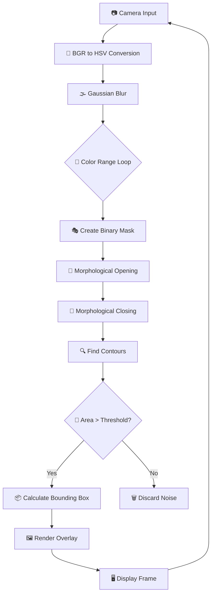
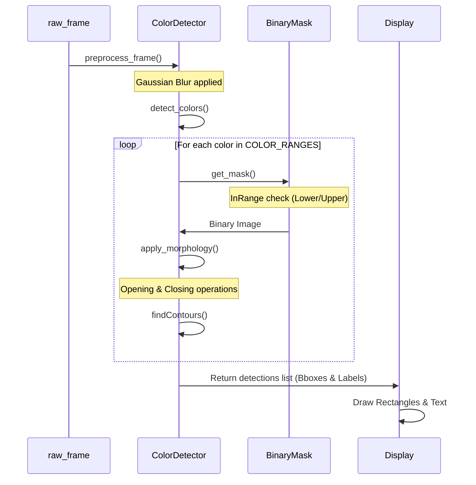

# 🎨 Real-Time Colour Detection System: Technical Specification


## 📌 Overview
This project is a high-performance Computer Vision (CV) pipeline designed to identify and track multiple color ranges in a real-time video stream. By leveraging the **HSV (Hue, Saturation, Value)** color space and **Morphological transformations**, the system achieves high robustness against lighting variations and sensor noise.

---

## ⚙️ System Specification

### 1. Hardware Requirements
- **Camera**: Standard USB Webcam or Integrated Camera (supporting BGR output).
- **Processor**: Dual-core CPU (minimum), Quad-core recommended for higher FPS.
- **Memory**: 4GB RAM minimum.

### 2. Software Stack
- **Language**: Python 3.8+
- **Libraries**:
    - `OpenCV (opencv-python)`: Image processing and camera interface.
    - `NumPy`: Matrix operations for masks and contour analysis.

---

## 🗺️ Architectural Flowcharts

### A. High-Level Logic Flow
This Mermaid diagram describes the step-by-step transformation of a raw camera frame into a detected color object.



### B. Data Transformation Pipeline
This sequence illustrates how data is mutated as it moves through the `ColorDetector` class.



---

## 🧪 Technical Deep Dive

### 1. The HSV Color Space vs RGB
The system avoids **RGB** because it conflates color (chrominance) and brightness (luminance).
- **Hue (H)**: Represents the "type" of color (0-180 in OpenCV).
- **Saturation (S)**: Represents the "intensity" or purity (0-255).
- **Value (V)**: Represents the brightness (0-255).

**Mathematical Logic**: By defining a range $[H_{min}, S_{min}, V_{min}]$ to $[H_{max}, S_{max}, V_{max}]$, we can isolate a color regardless of whether it is in a shadow or under a bright light.

### 2. Noise Reduction Strategy (The "Flicker-Free" Logic)
To prevent "jumping" bounding boxes, the system implements three layers of filtering:
1. **Gaussian Blur**: A low-pass filter that removes high-frequency noise (grain).
2. **Morphological Opening**: $\text{Erosion} \rightarrow \text{Dilation}$. It removes small white noise (salt) from the mask.
3. **Morphological Closing**: $\text{Dilation} \rightarrow \text{Erosion}$. It fills small holes inside a detected object to create a solid contour.
4. **Contour Area Filtering**: Any object with an area smaller than `MIN_CONTOUR_AREA` is ignored.

### 3. The "Red Wrap-Around" Problem
In the HSV wheel, Red exists at both the **0°** and **180°** marks. To detect Red accurately, the system uses a **dual-mask approach**:
$\text{Mask}_{Red} = \text{InRange}(\text{Range}_1) \cup \text{InRange}(\text{Range}_2)$

---

## 📁 Implementation Details

### Class: `ColorDetector`
| Method | Purpose | Complexity |
| :--- | :--- | :--- |
| `preprocess_frame()` | Reduces noise using Gaussian Kernel. | $O(W \times H)$ |
| `get_mask()` | Creates binary image for a specific range. | $O(W \times H)$ |
| `apply_morphology()` | Cleans mask using Opening/Closing. | $O(W \times H)$ |
| `detect_colors()` | Orchestrates the full detection loop. | $O(C \times W \times H)$ |

*Where $W$=Width, $H$=Height, $C$=Number of Colors.*

---

## 🏁 Setup & Usage

### Installation
```bash
pip install opencv-python numpy
```

### Execution
```bash
python colour_detection.py
```

### Calibration Guide
1. Open `color_tester.html` in a browser.
2. Select the target color using the color picker.
3. Copy the **OpenCV HSV** values.
4. Update the `COLOR_RANGES` dictionary in `colour_detection.py`.

---

## 🗺️ Future Roadmap
- [ ] **Dynamic Thresholding**: Auto-adjust HSV ranges based on ambient light.
- [ ] **Object Tracking**: Implement Kalman Filters for smoother box movement.
- [ ] **Multi-Threaded Capture**: Move camera reading to a separate thread to increase FPS.
- [ ] **YOLOv8 Integration**: Transition from color-masking to deep-learning object detection.

## 📜 License
This project is licensed under the **MIT License**.
